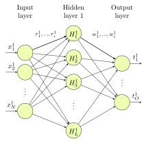
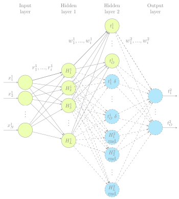
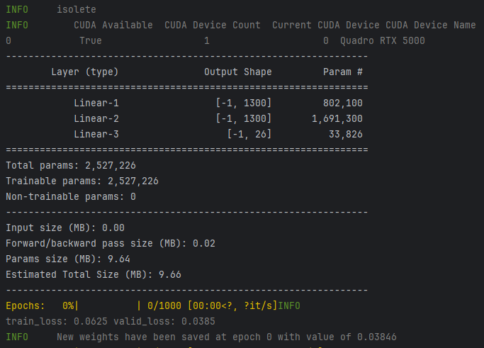
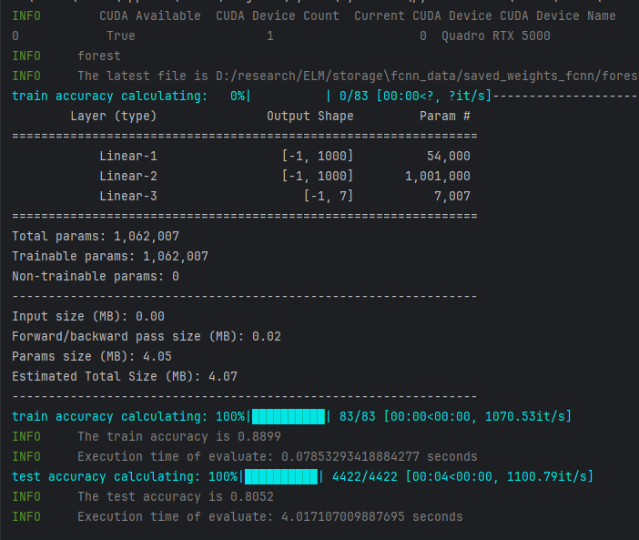
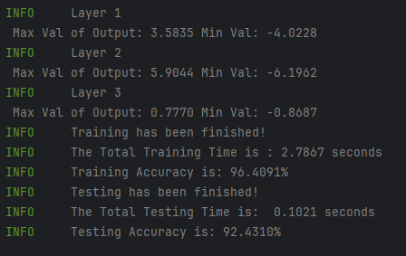
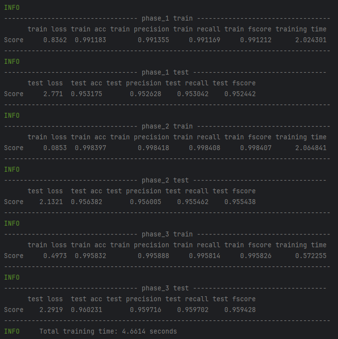
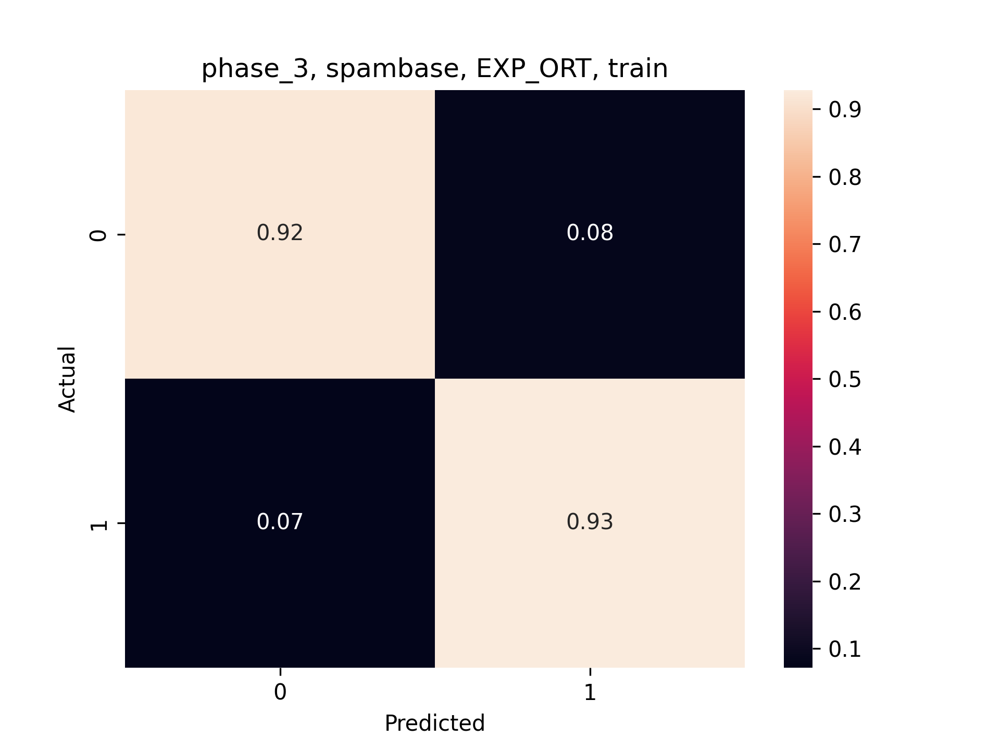
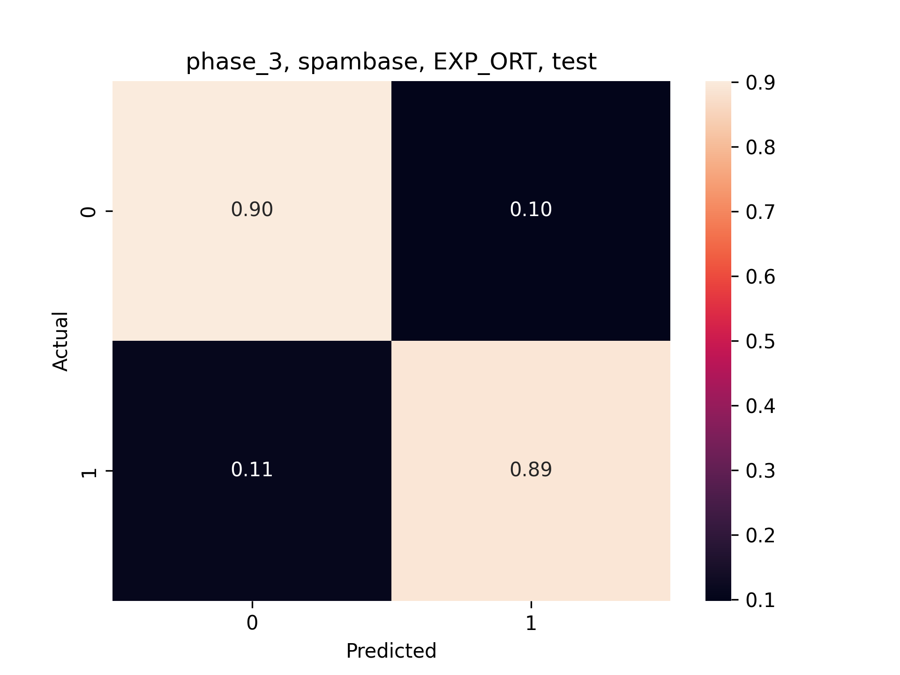

# Deep Randomized Networks for Fast Learning

Deep learning neural networks show a significant improvement over shallow ones in complex problems. Their main disadvantage is their memory requirements, the vanishing gradient problem, and the time consuming solutions to find the best achievable weights and other parameters. Since many applications (such as continuous learning) would need fast training, one possible solution is the application of sub-networks which can be trained very fast. Randomized single layer networks became very popular due to their fast optimization while their extensions, for more complex structures, could increase their prediction accuracy. In our paper we show a new approach to build deep neural models for classification tasks with an iterative, pseudo-inverse optimization technique. We compare the performance with a state-of-the-art backpropagation method and the best known randomized approach called hierarchical extreme learning machine. Computation time and prediction accuracy are evaluated on 12 benchmark datasets, showing that our approach is competitive in many cases.

 The overview of our approach can be drawn by two kinds of phases in four main steps:

-  Create a single ELM network and compute its output weights as the first iteration. This is the first approximation for the solution.
-  Add new neurons to extend the output layer (which now becomes a hidden layer) of the previous phase and add new output neurons at the top level becoming the new output layer.
-  Compute the weights for the new output layer with the matrix inversion technique.
-  Repeat Steps 2-3 as further phases.

<figure align="center">
  <figcaption>Phase 1</figcaption>
  
</figure>

<figure align="center">
  <figcaption>Phase 2</figcaption>
  
</figure>

## Datasets
All the datasets can be accessed in the following link:
https://drive.google.com/file/d/13CnoFZAJj12jia6r3L17YJJ1rANAwSR7/view?usp=sharing

To convert the .txt files into .npy file format, use the `convert_dataset.py` script.

The following datasets are employed in this framework: 

| Dataset       | #Features | #Train | #Test   | #Classes |
|---------------|-----------|--------|---------|----------|
| Connect4      | 42        | 50,000 | 17,577  | 3        | 
| Forest        | 54        | 15,120 | 56,5892 | 7        | 
| Iris          | 4         | 105    | 45      | 3        | 
| Isolete       | 617       | 6,238  | 1,559   | 26       | 
| Letter        | 16        | 10,500 | 9,500   | 26       | 
| MNIST         | 784       | 60,000 | 10,000  | 10       | 
| MNIST Fashon  | 784       | 60,000 | 10,000  | 10       | 
| Musk2         | 166       | 3,000  | 3,598   | 2        | 
| Optdigits     | 64        | 3,822  | 1,797   | 10       | 
| Page blocks   | 10        | 4,385  | 1,100   | 5        | 
| Satimages     | 36        | 4,435  | 2,000   | 6        | 
| Segment       | 19        | 1,733  | 577     | 7        | 
| Shuttle       | 9         | 29,834 | 26,936  | 7        | 
| Spambase      | 57        | 3,681  | 920     | 2        | 
| USPS          | 256       | 7,291  | 2,007   | 10       | 
| YaleB         | 1024      | 1,680  | 734     | 38       | 


## Requirements
Make sure you have the following dependencies installed:

```bash
colorlog==6.7.0
keras==2.10.0
matplotlib==3.7.1
numpy==1.23.5
pandas==2.0.0
scipy==1.10.1
seaborn==0.12.2
sklearn==1.2.2
torch==2.0.0+cu117
torchsummary==1.5.1
torchvision==0.15.1+cu117
tqdm==4.65.0
```

## Installation
First, clone/download this repository. In the `const.py` file you will find this:

```python
root_mapping = {
    'ricsi': {
        "PROJECT_ROOT":
            "D:/research/ELM/storage",
        "DATASET_ROOT":
            "D:/research/ELM/datasets"
    }
}
```

- Update the designated username ('ricsi') to reflect the username associated with your logged-in operating system.
- Utilize PROJECT_ROOT as the central repository for storing essential data such as weights and images
- Employ DATASET_ROOT as the designated directory for managing datasets integral to the functioning of the project.
- `const.py` will create all the necessary folders.
- Download the datasets and place them into the appropriate folder (in my case it is the DATASET_ROOT.


## Fully Connectedn Neural Network - FCNN

Fully-connected neural network (FCNN) with 3 layers and the same number
of neurons as the other networks. The hyperparameters were the following:
the network was trained until convergence, we used the ADAM optimizer
with learning rate set to 10^-3. Batch size was selected to 128 in all cases. The
main purpose with this network is to get impressions how successfully the
iterative backpropagation (BP) could be substituted with the randomized
approach.

### Usage

To train FCNN, set dataset_name in the `config.py` file within the `DatasetConfig()` class. Settings regarding the FCNN 
itself can be found in the _FCNNConfig()_ class. FCNN is separated to train and evaluation, so first run `train_fcnn.py`, 
after training, run `eval_fcnn.py`.

`train_fcnn.py` logs the loss function with tensorboard, also only the best weights will be saved. The model will be 
trained until early stopping is activated. By default, the patience is 15 epochs. 

<figure align="center">
  <figcaption>Training of a model with FCNN</figcaption>
  
</figure>

`eval_fcnn.py` will find the latest directory with the latest model (.pt) file, and will load these weights into the model.
It calculates both the train and the test accuracies, and finally saves the results into a .txt file.

<figure align="center">
  <figcaption>Evaluation of a model with FCNN</figcaption>
  
</figure>


## Hierarchical ELM - HELM
Beside leaving the orthogonality condition for the random weights of the ELMAE,
the l2 norm was replaced by l1, and the FISTA algorithm was used to
compute the output weights instead of the matrix inversion technique.

It is our python implementation of the network. 
Originally it was implemented in MATLAB, the source files of the original code can
be found here: https://www.extreme-learning-machines.org/

### Usage

HELM is not separated to train and evaluation files, both operations happen in the same file. Select the desired dataset
in the `config.py` file, similarly as with FCNN, and set the parameters of HELM in the `HELMConfig()` class.

<figure align="center">
  <figcaption>HELM training and testing</figcaption>
  
</figure>


## Multi Phase Deep Random Neural Network - MPDRNN

We implemented three variants, namely:

### **BASE**
As explained above, this is our Baseline method.

### **Exp-Ort**

To follow the general pattern of deep networks, instead of equally
distributed number of neurons, their number was decreasing exponentially
from layer to layer (the sum of neurons did not change). Besides, to increase
the uniformity of random weights, only half of the originally determined random weights
were generated, while the other half was generated as their orthogonal vectors.

### **Exp-Ort-C**
In another case we modified the Exp. Ort. model by adding the C regularization 
factor and tried to find its optimal value

### Usage

As before, select the desired dataset in the `config.py` file, set the arguments in the `MPDRNNConfig()` class, and run
`main.py`. The different variants can be selected with the _--method_ argument.
Just like in HELM, training and evaluation happen in the same loop.

<figure align="center">
  <figcaption>MPDRNN training and testing</figcaption>
  
</figure>

During testing, confusion matrices are generated.

<figure align="center">
  <figcaption>Confusion matrix, phase 3, on Spambase dataset, using the Exp-Ort method</figcaption>
  
</figure>

<figure align="center">
  <figcaption>Confusion matrix, phase 3, on Spambase dataset, using the Exp-Ort method</figcaption>
  
</figure>
