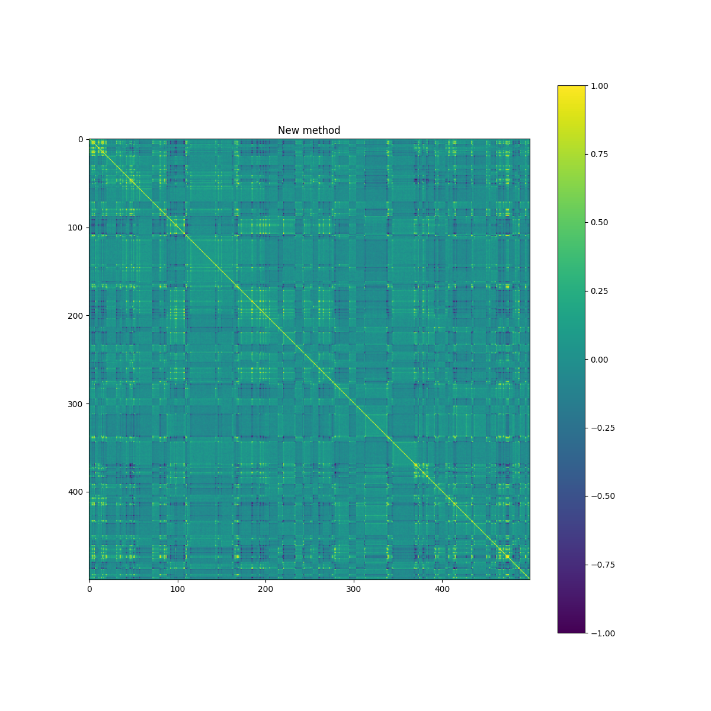
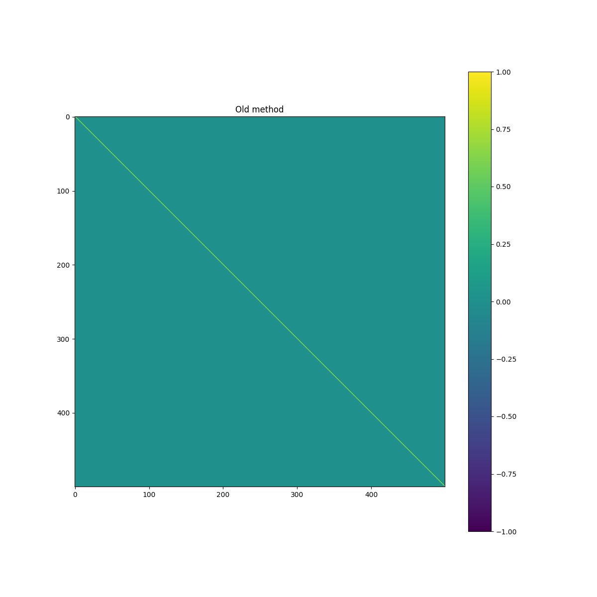
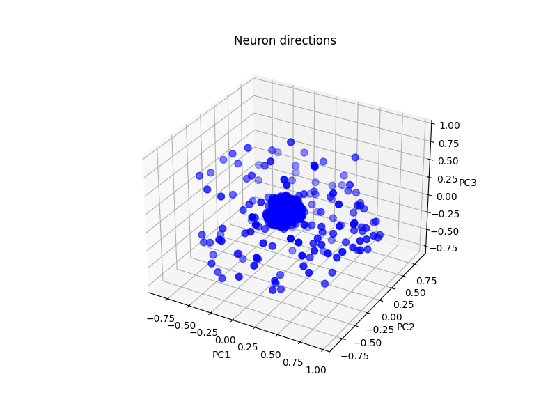
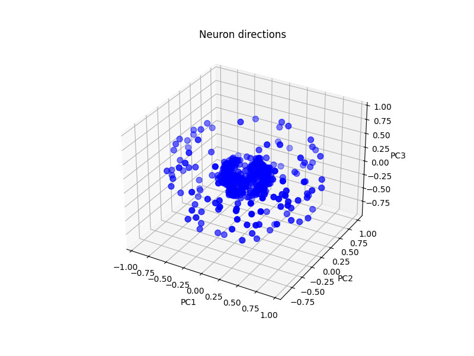
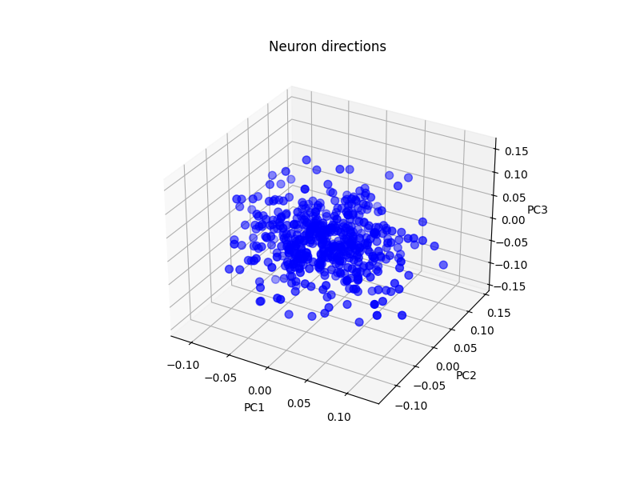

# 2026-02-05

A **letter** adathalmazon megvizsgáltam a következőket:
- Az újonnan generált neuron-vektorok iránybeli hasonlóságát:
  - Ehhez az egységvektorokra számított cosine similarity mátrixot hőtérképként ábrázoltam.

1. A második réteget az új módszerrel hoztam létre. Itt a heatmap a következőképpen jelenik meg:

 
2. Aztán a hamradik rétegben is elvégeztem ezt, szintén az új módszerrel.

3. Végezetül a harmadik rétegben a régi módszerrel is megismételtem.

- Ugyanezen vektorokat 3D-ben scatter ploton ábrázoltam, PCA-val 3 komponensre vetítve
  - Második réteg, új módszer

  - Harmadik réteg, új módszer

  - Harmadik réteg, régi módszer

